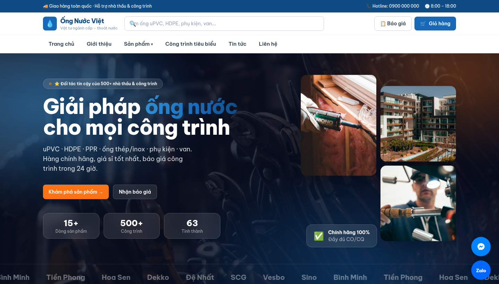

<div align="center">

# 💧 Ống Nước Việt

### Website thương mại điện tử & CMS cho ngành ống nước, vật tư cấp – thoát nước

[](https://nextjs.org/)
[](https://react.dev/)
[](https://www.typescriptlang.org/)
[](https://www.prisma.io/)
[](https://tailwindcss.com/)

<br/>



</div>

---

## 📖 Giới thiệu

**Ống Nước Việt** là nền tảng bán hàng trực tuyến hoàn chỉnh cho doanh nghiệp kinh doanh
ống nước (uPVC, HDPE, PPR, thép/inox), phụ kiện và van. Dự án bao gồm **website bán hàng**
cho khách lẻ & nhà thầu, cùng **hệ quản trị nội dung (CMS)** cho phép chủ shop tự vận hành
gần như toàn bộ nội dung mà không cần lập trình viên.

> Tài liệu nghiệp vụ: [PHAN-TICH-NGHIEP-VU.md](PHAN-TICH-NGHIEP-VU.md) · Kế hoạch: [KE-HOACH-CONG-VIEC.md](KE-HOACH-CONG-VIEC.md)

---

## ✨ Tính năng

### 🛒 Phía khách hàng
- **Trang chủ** hiện đại: hero động (aurora gradient), banner, danh mục, sản phẩm nổi bật, công trình tiêu biểu, cảm nhận khách hàng
- **Danh sách sản phẩm**: lọc theo danh mục / vật liệu / thương hiệu, tìm kiếm, sắp xếp giá; bộ lọc thu gọn dạng drawer trên mobile
- **Chi tiết sản phẩm**: thông số kỹ thuật, **bảng giá theo số lượng**, sản phẩm liên quan
- **Giỏ hàng** (lưu localStorage) & **Thanh toán COD** (tự trừ tồn kho)
- **Yêu cầu báo giá (RFQ)** cho nhà thầu: gợi ý sản phẩm tự động + cho phép gõ tự do
- **Công trình tiêu biểu**, **Tin tức**, **Giới thiệu**, **Liên hệ** (form gửi thật + bản đồ)
- **Nút liên hệ nổi**: Gọi điện · Zalo · Messenger
- **Responsive** đầy đủ, **SEO-friendly**, hỗ trợ tiếng Việt (font Be Vietnam Pro)

### 🔐 Phía quản trị (CMS)
| Module | Chức năng |
|--------|-----------|
| 📊 **Tổng quan** | Doanh thu, đơn chờ xử lý, cảnh báo tồn kho thấp |
| 📦 **Sản phẩm** | CRUD, upload ảnh, SKU tự sinh, giá lẻ/sỉ, bảng giá bậc số lượng |
| 🗂️ **Danh mục** | CRUD + ảnh; tự hiện trong menu & bộ lọc |
| 🧾 **Đơn hàng** | Đổi trạng thái, **xuất hóa đơn Excel + phiếu in PDF** |
| 💬 **Báo giá (RFQ)** | Nhập giá, VAT/chiết khấu, **xuất Excel + phiếu PDF** gửi khách |
| 📨 **Tin nhắn liên hệ** | Nhận lời nhắn khách, đánh dấu đã đọc, gọi lại |
| 🏗️ **Công trình** | CRUD công trình tiêu biểu + ảnh |
| 📰 **Tin tức** | CRUD bài viết + ảnh, nháp/xuất bản |
| 🏢 **Trang Giới thiệu** | Sửa toàn bộ nội dung (hero, câu chuyện, giá trị, mốc lịch sử) |
| ⚙️ **Cấu hình website** | Logo, thông tin liên hệ, banner trang chủ, bản đồ, nút liên hệ nổi |

- **Xác thực** bằng JWT (cookie) + middleware bảo vệ, phân quyền nhân viên
- **Upload ảnh** trực tiếp từ máy, **xuất Excel** (ExcelJS) và **phiếu in PDF** chuyên nghiệp

---

## 🛠️ Công nghệ

| Thành phần | Công nghệ |
|------------|-----------|
| Framework | **Next.js 14** (App Router, Server Actions) |
| Ngôn ngữ | **TypeScript** |
| Giao diện | **TailwindCSS** + font Be Vietnam Pro |
| Cơ sở dữ liệu | **Prisma ORM** + **SQLite** (dễ đổi sang PostgreSQL/MySQL) |
| Xác thực | **jose** (JWT) + **bcryptjs** |
| Xuất file | **ExcelJS** (.xlsx) + trang in PDF (print CSS) |
| Kiểm tra dữ liệu | **Zod** |

---

## 🚀 Cài đặt & chạy

> Yêu cầu: **Node.js ≥ 18**

```bash
# 1. Cài thư viện
npm install

# 2. Tạo file .env từ mẫu (rồi đổi AUTH_SECRET)
cp .env.example .env

# 3. Khởi tạo cơ sở dữ liệu + dữ liệu mẫu
npx prisma generate
npx prisma db push
npm run db:seed

# 4. Chạy ở chế độ phát triển
npm run dev
```

Mở trình duyệt tại **http://localhost:3000** — trang quản trị tại **http://localhost:3000/admin**.

### 🔑 Tài khoản quản trị (demo)
| Vai trò | Email | Mật khẩu |
|---------|-------|----------|
| Quản trị | `admin@ongnuoc.vn` | `admin123` |

> Khách hàng **không cần đăng nhập** — mua hàng theo kiểu khách vãng lai (COD).
> ⚠️ Đổi mật khẩu admin và `AUTH_SECRET` trước khi triển khai thật.

---

## ⚙️ Biến môi trường

Tạo file `.env` ở thư mục gốc:

```env
DATABASE_URL="file:./dev.db"
AUTH_SECRET="chuoi-bi-mat-ngau-nhien-doi-truoc-khi-deploy"
```

---

## 📜 Scripts

| Lệnh | Mô tả |
|------|-------|
| `npm run dev` | Chạy môi trường phát triển |
| `npm run build` | Build production |
| `npm run start` | Chạy bản production đã build |
| `npm run db:push` | Đồng bộ schema vào DB |
| `npm run db:seed` | Nạp dữ liệu mẫu |
| `npm run db:reset` | Xóa & tạo lại DB + seed |

---

## 📁 Cấu trúc thư mục

```
.
├── prisma/
│   ├── schema.prisma        # Mô hình dữ liệu (sản phẩm, đơn hàng, báo giá, CMS...)
│   └── seed.ts              # Dữ liệu mẫu
├── src/
│   ├── app/
│   │   ├── (shop)/          # Website khách (Header/Footer, nút liên hệ nổi)
│   │   ├── admin/           # Trang quản trị (CRUD + CMS)
│   │   ├── in/              # Phiếu in PDF (báo giá, hóa đơn)
│   │   └── api/             # API: orders, quotations, contact, upload, media, auth
│   ├── components/          # Header, Footer, ProductCard, các Form, FloatingContact...
│   └── lib/                 # prisma, auth, settings (CMS), cms, format, quote...
├── uploads/                 # Ảnh upload (ngoài public, phục vụ qua /api/media)
├── public/                  # Ảnh tĩnh (sản phẩm, banner, dự án, tin tức)
├── deploy/                  # Script triển khai Google Cloud (Nginx + PM2 + HTTPS)
└── ecosystem.config.js      # Cấu hình PM2 chạy app 24/7
```

---

## 🚢 Triển khai (Deployment)

Dự án đã chuẩn bị sẵn bộ deploy lên **Google Cloud (Compute Engine VM)** với
**Nginx + PM2 + Certbot (HTTPS)** trong thư mục [`deploy/`](deploy/).

> 📘 Hướng dẫn chi tiết từng bước: **[HUONG-DAN-DEPLOY.md](HUONG-DAN-DEPLOY.md)**

```bash
# Trên VM (Ubuntu), chạy 3 lệnh theo thứ tự:
bash deploy/1-setup-vm.sh      # cài Node, Nginx, PM2, Certbot (1 lần)
bash deploy/2-deploy.sh        # build & chạy app bằng PM2 (tự sinh .env)
bash deploy/3-setup-domain.sh  # gắn tên miền + chứng chỉ HTTPS
```

App chạy nền 24/7 qua PM2 ([`ecosystem.config.js`](ecosystem.config.js)); sao lưu DB bằng `deploy/backup.sh`.

**Lưu ý khi lên production:**
- `AUTH_SECRET` được script tự sinh ngẫu nhiên; đổi mật khẩu tài khoản admin
- Có thể chuyển **SQLite → PostgreSQL/MySQL** (sửa `datasource` trong `schema.prisma`)
- Ảnh upload lưu ở thư mục `uploads/`; nếu chuyển sang **serverless (Vercel)** cần lưu cloud (S3/Cloudinary)

---

## 🗺️ Lộ trình mở rộng

- [ ] Thanh toán online (VNPay / MoMo)
- [ ] Tích hợp vận chuyển (GHN / GHTK) — tính phí tự động
- [ ] Tài khoản B2B tự hiển thị giá sỉ + công nợ
- [ ] Thông báo email/Zalo khi có đơn / lời nhắn mới
- [ ] Báo cáo & thống kê nâng cao

---

<div align="center">

Made with 💧 for the Vietnamese plumbing industry

</div>
